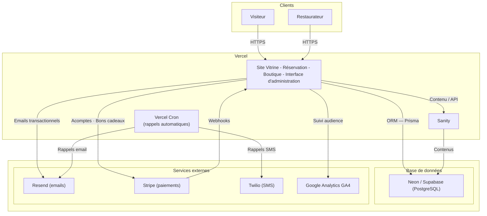

# PARTIE A — Documentation technique

---

## 1. Vue d'ensemble

### 1.1 Objectifs du projet

Le site ANØV est conçu pour répondre à quatre objectifs principaux :

<!-- - Offrir une vitrine digitale reflétant l'identité et l'univers du restaurant -->
- Sécuriser les réservations et réduire les no-shows via acompte et rappels automatiques
<!-- - Générer des ventes additionnelles via la boutique de bons cadeaux
- Maximiser la visibilité locale sur Google -->

### 1.2 Stack technique

| Composant              | Technologie                  |
| ---------------------- | ---------------------------- |
| Framework              | Next.js (App Router)         |
| Hébergement            | Vercel                       |
<!-- | CMS                    | Sanity                       | -->
| Base de données        | Neon / Supabase (PostgreSQL) |
| ORM                    | Prisma                       |
| Emails transactionnels | Resend                       |
| Paiements              | Stripe                       |
| SMS                    | Twilio                       |
<!-- | Internationalisation   | next-intl (FR · EN · DE)     | -->

### 1.3 Architecture

#### Schéma global (modules & services)

L'application est déployée sur Vercel. Le frontend Next.js expose le site web et l'interface d'administration. Le site web consomme Sanity via une API REST. Les services tiers (Stripe, Resend, Twilio) sont appelés directement depuis les fonctions serverless de Vercel ou via des webhooks.



#### Routes

| Route | Description |
|---|---|
<!-- | `/` | Page principale (vitrine) — single-page scrollable | -->
<!-- | `/#histoire` | Storytelling du restaurant | -->
<!-- | `/#origines` | Carte France + provenance des produits | -->
<!-- | `/#galerie` | Galerie photos | -->
<!-- | `/#contact` | Formulaire de contact | -->
<!-- | `/carte` | Carte des plats | -->
<!-- | `/boutique` | Module boutique — bons cadeaux | -->
| `/reservation` | Module de réservation en ligne |
<!-- | `/mentions-legales` | Mentions légales |
| `/confidentialite` | Politique de confidentialité (RGPD) |
| `/cgv` | Conditions générales de vente | -->
<!-- | `/paiement` | Moyens de paiement acceptés | -->
| `/admin` | Interface d'administration du restaurant. |
| `/admin/reservations` | Gestion des réservations |

#### Base de données (tables & relations)

La base de données PostgreSQL (Neon / Supabase) centralise les données métier des modules Réservations et Boutique. Sanity dispose de sa propre connexion (schéma séparé ou instance dédiée selon la configuration retenue au déploiement).

| Table | Module | Champs principaux |
|---|---|---|
| `reservations` | Réservations | id, date, time_slot, covers, customer_id, status, deposit_id |
| `customers` | Réservations | id, name, email, phone, preferences, created_at |
| `time_slots` | Réservations | id, date, start_time, capacity, booked_covers |
| `deposits` | Réservations | id, reservation_id, stripe_payment_intent_id, amount, status |
<!-- | `gift_vouchers` | Boutique | id, code, type, amount, purchaser_email, recipient_email, status, expires_at |
| `voucher_payments` | Boutique | id, voucher_id, stripe_payment_intent_id, amount, status | -->

#### Organisation du dépot Git

```
anov/                         ← monorepo
├── src/                         ← code frontend Next.js
│   ├── app/                         ← pages et composants spécifiques aux routes
│   ├── components/                   ← composants réutilisables
│   ├── lib/                          ← fonctions utilitaires (API clients, formatage, etc.)
│   ├── styles/                       ← fichiers CSS / Tailwind
│   └── ...                           ← autres dossiers (hooks, context, etc.)
├── emails/                      ← templates d'emails React Email
├── prisma/                      ← schéma Prisma et migrations
├── .env                          ← variables d'environnement locales (ne pas versionner)
├── next.config.js                 ← configuration Next.js
```

<!-- #### Sanity — CMS headless

L'interface d'administration de Sanity est accessible à une URL dédiée (ex. `cms.anov.fr`) et protégée par un système d'authentification propre à Sanity.

> Les contenus éditoriaux (carte, galerie, histoire, horaires) sont stockés dans la base de données Sanity et exposés via son API REST. Ils ne sont pas dupliqués dans la base applicative.

Sanity tourne dans son propre dépôt ou service hébergé séparé. -->

<!-- ---

## 2. Module 1 — Site vitrine

La page principale est une single-page scrollable accessible à la racine `/`. Son contenu est entièrement géré via Strapi, ce qui permet au restaurateur de le modifier sans intervention du développeur.

### 2.1 Sections et contenu

#### Section histoire

Texte d'introduction au restaurant, identité et ambiance. Contenu modifiable via Strapi (champ texte riche).

#### Section carte

- Affichage en liste verticale (rectangles empilés)
- Au survol / tap : photo du plat + liste des allergènes
- Organisée par catégories (entrées, plats, desserts…)
- Prix, descriptions, allergènes et photos modifiables via Strapi
- Un plat peut être masqué temporairement (rupture, plat du jour) sans être supprimé

#### Section origines

- Carte de France centrée sur Besançon
- Rayons vectoriels vers les régions d'origine de chaque produit
- Au survol d'un rayon : informations sur le produit et le producteur
- Texte animé à l'entrée dans la section (intersection observer)

#### Section galerie

- Grille photos optimisée — lazy loading, format WebP, srcset responsive
- Photos ajoutables, supprimables et réordonnables via Strapi

#### Footer

- Plan d'accès Google Maps embarqué
- Liens vers les réseaux sociaux (Instagram, Facebook)
- Mention accessibilité PMR
- Liens vers les pages légales

### 2.2 Formulaire de contact

Le formulaire de contact est intégré dans la section `/#contact`. Il collecte les champs nom, email et message.

Fonctionnement :

1. L'utilisateur soumet le formulaire
2. Protection anti-spam : honeypot field + rate limiting par IP
3. L'email est transmis au restaurant via Resend
4. Un message de confirmation est affiché à l'utilisateur

> Le formulaire de contact ne génère aucune donnée persistée en base. L'email est relayé directement vers la boîte du restaurateur.

### 2.3 Multilingue & SEO

#### Internationalisation

Le site est disponible en français, anglais et allemand via `next-intl`. Le visiteur change de langue via un sélecteur dans la navigation. Les traductions sont stockées dans des fichiers JSON versionnés dans le dépôt (`/messages/fr.json`, `/messages/en.json`, `/messages/de.json`).

- Les contenus éditoriaux (carte, histoire…) sont traduits directement dans Strapi
- Les libellés d'interface sont gérés via les fichiers JSON next-intl

#### SEO technique

| Élément | Mise en œuvre |
|---|---|
| Meta tags dynamiques | `title`, `description`, OpenGraph, Twitter Card — générés par page via Next.js Metadata API |
| Données structurées | JSON-LD de type `Restaurant` injectées dans le `<head>` de chaque page |
| Sitemap | Généré automatiquement à `/sitemap.xml` via next-sitemap |
| Robots.txt | Fichier `/robots.txt` configuré pour autoriser l'indexation complète |
| URLs | Routes lisibles, sans paramètres dynamiques superflus |
| Performance | Images WebP + lazy loading, bundle optimisé, Core Web Vitals surveillés |
| Accessibilité | Conformité WCAG AA — balises ARIA, contraste, navigation clavier |
| Google Search Console | Domaine vérifié, sitemap soumis, suivi des erreurs d'indexation |
| Google Analytics GA4 | Suivi des sessions, pages vues et conversions (réservation, achat bon cadeau) |
| Google Business Profile | Fiche maintenue à jour — catégorie, horaires, photos, avis |

--- -->

## 3. Module 2 — Réservations

Le module de réservation est accessible à `/reservation`. Il gère l'intégralité du cycle de vie d'une réservation, de la sélection du créneau jusqu'aux rappels automatiques, en passant par la collecte d'un acompte pour les groupes.

### 3.1 Parcours utilisateur

1. Le client sélectionne une date et un créneau horaire
2. Le système vérifie les disponibilités en temps réel (places restantes)
3. Le client renseigne ses coordonnées : nom, email, téléphone, nombre de couverts
4. Pour les groupes (seuil configurable, ex. 8+ personnes) : paiement d'un acompte via Stripe
5. Un email de confirmation est envoyé automatiquement
6. Un rappel est envoyé automatiquement la veille (email + SMS optionnel)

### 3.2 Règles de capacité & disponibilités

Le système gère la capacité du restaurant à la granularité de la table, afin d'éviter toute sur-réservation.

- Capacité totale : 15 à 20 couverts (à paramétrer au déploiement)
- Chaque créneau horaire est associé à un compteur de couverts disponibles
- La disponibilité est calculée en temps réel à chaque requête
- Protection contre les doubles réservations par verrouillage optimiste en base (`SELECT FOR UPDATE`)
- Un créneau peut être désactivé manuellement depuis l'interface admin (ex. soirée privée)

### 3.3 Acomptes & annulations

#### Acomptes

Les acomptes s'appliquent aux réservations de groupe au-delà d'un seuil de couverts défini. Ils sont traités via Stripe Payment Intents.

- Montant de l'acompte : à définir (valeur fixe ou pourcentage)
- Le Payment Intent est créé côté serveur ; le client complète le paiement via Stripe Elements
- Le webhook `payment_intent.succeeded` confirme la réservation en base
- En cas d'échec de paiement, la réservation reste en statut `pending` et expire après un délai configurable

#### Annulations

- Le client peut annuler via un lien horodaté et signé inclus dans son email de confirmation
- La politique de remboursement (partiel, total, aucun) est définie dans les CGV et appliquée manuellement via le dashboard Stripe
- L'annulation libère le créneau en base et décrémente le compteur de couverts
- Le restaurateur peut annuler manuellement depuis l'interface admin ; un email d'annulation est alors envoyé automatiquement au client

### 3.4 Fiches clients (RGPD)

Les informations collectées lors d'une réservation sont stockées en base (table `customers`) conformément au RGPD.

| Donnée | Usage |
|---|---|
| Nom | Identification du client, affichage dans l'interface admin |
| Email | Confirmation, rappels, lien d'annulation |
| Téléphone | Rappel SMS (optionnel), contact en cas d'urgence |
| Historique réservations | Pré-remplissage des formulaires futurs |
| Préférences | Allergies, occasions spéciales — champ optionnel libre |

- Consentement explicite obligatoire (case à cocher) avant soumission du formulaire
- Durée de conservation : à définir (ex. 24 mois) — suppression automatique via Vercel Cron
- Droit à la suppression : disponible sur demande écrite au restaurateur

### 3.5 Rappels automatiques

Les rappels sont orchestrés par un job Vercel Cron déclenché chaque jour à une heure configurable.

| Déclencheur | Canal | Contenu |
|---|---|---|
| Confirmation immédiate | Email (Resend) | Récapitulatif, date, heure, couverts, lien d'annulation |
| J-1 (veille) | Email (Resend) | Rappel de la réservation, informations pratiques |
| J-1 (veille) | SMS Twilio (opt.) | Message court : heure, nom du restaurant, lien de contact |

> Les templates d'emails sont versionnés dans `/packages/emails/`. Ils sont construits avec React Email et compilés au build. Toute modification de template nécessite un redéploiement.

---

## 4. Module 3 — Boutique

La boutique est accessible à `/boutique`. Elle permet l'achat de bons cadeaux en ligne, leur génération au format PDF et leur vérification par le restaurateur lors de l'encaissement.

### 4.1 Parcours d'achat

1. Le client choisit un bon : montant libre ou formule prédéfinie (ex. « Dîner pour 2 »)
2. Il renseigne ses coordonnées et, si souhaité, les coordonnées du destinataire
3. Il règle via Stripe (carte bancaire sécurisée)
4. Le webhook `payment_intent.succeeded` déclenche la génération du PDF
5. Le PDF est envoyé par email à l'acheteur ; une copie est envoyée au destinataire si son email a été renseigné
6. Un enregistrement est créé en base (table `gift_vouchers`) avec un code unique et une date d'expiration

### 4.2 Génération du bon cadeau PDF

Le PDF est généré côté serveur (Vercel Serverless Function) au moment du webhook de confirmation de paiement.

Composition du bon cadeau :

- Code unique alphanumérique sécurisé (généré avec `crypto.randomBytes`)
- QR code encodant le code unique (pour faciliter la vérification en caisse)
- Montant ou intitulé de la prestation
- Date d'émission et date d'expiration
- Design aux couleurs et à la typographie du restaurant

> Le template PDF est versionné dans le dépôt. Toute modification graphique du bon nécessite une mise à jour du template et un redéploiement.

### 4.3 Vérification & encaissement

Depuis l'interface d'administration (Strapi), le restaurateur peut vérifier et encaisser les bons cadeaux présentés par les clients.

| Action | Comportement |
|---|---|
| Saisir un code | Recherche dans la table `gift_vouchers` — résultat immédiat |
| Scanner le QR code | Décode le code et lance la même vérification (si terminal compatible) |
| Statut `Valide` | Le bon est actif et peut être encaissé |
| Statut `Déjà utilisé` | Le bon a déjà été marqué comme encaissé — affichage de la date d'utilisation |
| Statut `Expiré` | La date d'expiration est dépassée — le bon ne peut plus être utilisé |
| Encaisser | Passe le statut à `used`, enregistre la date et l'heure en base |

---

## 5. Services tiers & coûts

### 5.1 Tableau récapitulatif

| Service | Rôle | Module(s) | Coût |
|---|---|---|---|
| Vercel | Hébergement + serverless + Cron | Tous | ~20 €/mois |
| Registrar | Nom de domaine | Tous | ~15 €/an |
| Neon / Supabase | Base de données PostgreSQL | Réservations, Boutique | Gratuit < 500 Mo, puis 20 €/mois |
| Strapi | CMS headless | Tous (contenu) | Gratuit + hébergement à définir |
| Resend | Emails transactionnels | Contact, Réservations, Boutique | Gratuit < 3 000/mois, puis 20 €/mois |
| Stripe | Paiements en ligne | Réservations, Boutique | 1,4 % + 0,25 € / transaction |
| Twilio | SMS de rappel | Réservations | 0,07 € / SMS |
| Google Analytics GA4 | Statistiques de visite | SEO | Gratuit |
| Google Search Console | Suivi référencement | SEO | Gratuit |
| Google Business Profile | Référencement local | SEO | Gratuit |

### 5.2 Variables d'environnement

Toutes les clés API sont stockées dans les variables d'environnement Vercel (Settings → Environment Variables). Aucune clé secrète ne doit figurer dans le code source ou dans un fichier versionné.

| Variable | Service | Usage |
|---|---|---|
| `DATABASE_URL` | Neon / Supabase | Connexion PostgreSQL (ORM) |
| `RESEND_API_KEY` | Resend | Envoi d'emails transactionnels |
| `STRIPE_SECRET_KEY` | Stripe | Création de Payment Intents |
| `STRIPE_WEBHOOK_SECRET` | Stripe | Vérification des webhooks entrants |
| `TWILIO_ACCOUNT_SID` | Twilio | Authentification API SMS |
| `TWILIO_AUTH_TOKEN` | Twilio | Authentification API SMS |
| `NEXTAUTH_SECRET` | Next.js | Signature des sessions |
| `STRAPI_API_URL` | Strapi | URL de base de l'API Strapi |
| `STRAPI_API_TOKEN` | Strapi | Token d'accès en lecture à l'API |

### 5.3 Accès développeur

| Service | Niveau d'accès |
|---|---|
| Vercel | Propriétaire du projet |
| Neon / Supabase | Admin (accès total à la base) |
| Strapi | Super Admin |
| Resend | Admin |
| Stripe | Admin — clés stockées en variables d'environnement uniquement |
| Twilio | Admin |

---

## 6. DevOps & maintenance

### 6.1 Environnements

| Environnement | URL | Usage |
|---|---|---|
| Development | `localhost:3000` | Développement local — base de données locale ou branche Neon dédiée |
| Preview | `*.vercel.app` (auto) | Chaque Pull Request dispose d'un environnement de preview isolé |
| Production | `anov.fr` | Environnement de production — branche `main` uniquement |

> Les environnements de preview utilisent les clés Stripe en mode test. Les webhooks Stripe de preview sont configurés dans le dashboard Stripe (section Webhooks → endpoints de test).

### 6.2 CI/CD

Le pipeline de déploiement est entièrement géré par Vercel et déclenché automatiquement à chaque push Git.

| Étape | Détail |
|---|---|
| Lint | ESLint — vérification statique du code TypeScript |
| Type check | `tsc --noEmit` — vérification des types |
| Build | `next build` — compilation et optimisation du bundle |
| Deploy | Vercel publie automatiquement si le build est vert |

### 6.3 Monitoring & alerting

| Outil | Ce qui est surveillé | Alerting |
|---|---|---|
| Vercel Analytics | Performance frontend, Core Web Vitals | Dashboard Vercel |
| Vercel Logs | Erreurs serverless, timeouts, logs d'accès | Dashboard Vercel |
| Stripe Dashboard | Paiements échoués, litiges, webhooks | Email Stripe |
| Resend Dashboard | Taux de délivrance, bounces, spam | Email Resend |
| Google Search Console | Erreurs d'indexation, couverture des pages | Email hebdomadaire |
| Google Analytics GA4 | Audience, taux de conversion, anomalies de trafic | Alertes personnalisées GA4 |

---

## 7. Procédures techniques

### 7.1 Déploiement initial

Procédure de mise en production à suivre dans l'ordre strict indiqué ci-dessous.

1. Créer le projet dans Vercel et connecter le dépôt Git
2. Configurer toutes les variables d'environnement dans Vercel (Settings → Environment Variables)
3. Connecter le nom de domaine personnalisé dans Vercel — pointer les DNS chez le registrar
4. Déployer Strapi sur son hébergement dédié (Render, Railway ou VPS) et créer le compte admin restaurateur
5. Configurer Stripe en mode production : remplacer les clés test, configurer le webhook de production
6. Vérifier le domaine dans Google Search Console et soumettre le sitemap
7. Connecter Google Analytics GA4 — vérifier la réception des events
8. Lancer un audit Lighthouse et corriger les points bloquants avant ouverture au public

### 7.2 Mises à jour & rotation de clés

#### Mise à jour des dépendances npm

À effectuer périodiquement (recommandé : mensuel pour les mises à jour de sécurité).

```bash
npx npm-check-updates -u
npm install
# Tester en local avant de pousser sur main
```

> Les mises à jour majeures de Strapi nécessitent une consultation du changelog officiel préalable. Les mises à jour mineures et de sécurité doivent être appliquées dans les 72 heures.

#### Rotation d'une clé API

1. Générer la nouvelle clé dans le dashboard du service concerné
2. Mettre à jour la variable d'environnement dans Vercel → Settings → Environment Variables
3. Déclencher un redéploiement manuel (ou pousser un commit vide)
4. Vérifier le bon fonctionnement en production
5. Révoquer l'ancienne clé dans le dashboard du service

> Ne jamais révoquer l'ancienne clé avant d'avoir vérifié que la nouvelle est opérationnelle en production. Une rotation mal exécutée peut interrompre les paiements ou les emails.

---

# PARTIE B — Guide restaurateur

> Ce guide vous permet de gérer votre site au quotidien, sans l'aide du développeur.

---

## 1. Vue d'ensemble de votre site

### 1.1 Les 3 modules

| Module | Adresse | Ce que vos clients peuvent faire |
|---|---|---|
| Site vitrine | `anov.fr` | Découvrir le restaurant, consulter la carte, voir la galerie, vous contacter |
| Réservations | `anov.fr/reservation` | Réserver une table en ligne avec confirmation automatique par email |
| Boutique | `anov.fr/boutique` | Acheter un bon cadeau, régler en ligne et le recevoir par email en PDF |

### 1.2 L'interface d'administration

Votre interface d'administration est basée sur Strapi. Elle vous permet de gérer l'ensemble du contenu et des opérations du site sans intervention du développeur.

| Depuis l'interface admin, vous pouvez… | Section concernée |
|---|---|
| Modifier la carte, les prix et les descriptions | Carte |
| Mettre à jour les horaires et les fermetures | Horaires |
| Gérer la galerie photos | Galerie |
| Consulter et gérer les réservations | Réservations |
| Vérifier et encaisser les bons cadeaux | Bons cadeaux |
| Modifier les informations générales (adresse, réseaux…) | Informations générales |

> L'adresse et les identifiants de votre interface d'administration sont indiqués en section 6.

---

## 2. Gérer votre contenu (via Strapi)

### 2.1 La carte & les prix

1. Connectez-vous à votre interface d'administration (voir section 6)
2. Cliquez sur **Carte** dans le menu latéral
3. Sélectionnez le plat à modifier, ou cliquez sur **Ajouter un plat**
4. Modifiez les champs : nom, description, prix, allergènes, photo
5. Cliquez sur **Enregistrer**

Les modifications sont visibles sur le site immédiatement après enregistrement.

Pour masquer temporairement un plat (rupture, plat du jour…) : ouvrez le plat concerné, décochez **Visible sur le site**, puis enregistrez. Le plat disparaît du site sans être supprimé.

### 2.2 Les horaires & fermetures

1. Dans l'interface d'administration, cliquez sur **Horaires**
2. Modifiez les créneaux d'ouverture pour chaque jour de la semaine
3. Pour une fermeture exceptionnelle : cliquez sur **Ajouter une fermeture**, indiquez la date et le motif
4. Cliquez sur **Enregistrer**

> Pensez à mettre à jour également vos horaires sur votre fiche Google Business Profile (`business.google.com`) — les deux ne sont pas synchronisés automatiquement.

### 2.3 La galerie photos

1. Dans l'interface d'administration, cliquez sur **Galerie**
2. Pour ajouter des photos : cliquez sur **Ajouter des photos** et sélectionnez vos images
3. Pour supprimer une photo : cliquez sur la photo, puis sur **Supprimer**
4. Pour réordonner : glissez-déposez les photos dans l'ordre souhaité

Format recommandé : JPG ou WebP, minimum 1 200 px de large. Les photos trop petites apparaîtront floues sur les écrans haute résolution.

### 2.4 Les informations générales

Depuis la section **Informations générales** de l'interface admin, vous pouvez mettre à jour :

- L'adresse du restaurant
- Le numéro de téléphone
- Les liens vers vos réseaux sociaux (Instagram, Facebook)
- Le texte de présentation (section Histoire)

---

## 3. Gérer les réservations

### 3.1 Consulter & filtrer

Les réservations arrivent automatiquement dans votre interface d'administration.

1. Dans l'interface d'administration, cliquez sur **Réservations**
2. Utilisez les filtres disponibles pour affiner la liste : date, statut (confirmée, annulée, en attente), nombre de couverts

### 3.2 Ajouter / annuler manuellement

**Ajouter une réservation (prise par téléphone) :**

1. Cliquez sur **Nouvelle réservation**
2. Renseignez les informations du client : nom, email, téléphone, date, heure, nombre de couverts
3. Validez — un email de confirmation est envoyé automatiquement au client

**Annuler une réservation :**

1. Trouvez la réservation dans la liste
2. Cliquez sur **Annuler la réservation**
3. Le client reçoit un email d'annulation automatiquement et le créneau est libéré

---

## 4. Gérer les bons cadeaux

### 4.1 Vérifier & encaisser un bon

1. Dans l'interface d'administration, cliquez sur **Bons cadeaux**
2. Saisissez le code présent sur le bon (ou scannez le QR code si votre terminal le permet)
3. Le statut s'affiche : **Valide**, **Déjà utilisé** ou **Expiré**
4. Si le bon est **Valide**, cliquez sur **Encaisser** pour le marquer comme utilisé

> Une fois un bon marqué Encaissé, l'opération est irréversible. Vérifiez bien le montant ou la prestation avant de valider.

### 4.2 Historique

L'historique complet des bons émis, utilisés et expirés est accessible dans la même section **Bons cadeaux**. Vous pouvez filtrer par statut ou par période.

---

## 5. Coûts & facturation

### 5.1 Forfait mensuel — 40 €/mois

Votre abonnement mensuel couvre l'ensemble des coûts fixes du site.

| Ce qui est inclus | Détail |
|---|---|
| Hébergement Vercel | Le site est en ligne 24h/24, 7j/7 |
| Nom de domaine | L'adresse de votre site, renouvelée chaque année |
| Base de données | Stockage des réservations, clients et bons cadeaux |
| Emails automatiques | Jusqu'à 3 000 emails/mois (confirmations, rappels, bons cadeaux) |
| Maintenance technique | Mises à jour, surveillance sécurité, monitoring |
| Support | Assistance en cas de problème |

### 5.2 Coûts variables

Ces coûts dépendent de votre activité et sont prélevés directement par les services concernés, indépendamment du forfait mensuel.

| Service | Déclencheur | Coût | Exemple |
|---|---|---|---|
| Stripe | Par transaction (acompte ou bon cadeau) | 1,4 % + 0,25 € | Bon à 50 € → frais 0,95 € → vous recevez 49,05 € |
| Twilio (SMS) | Par SMS de rappel envoyé | 0,07 € | 100 réservations → ~7 €/mois |
| Emails (dépassement) | Si plus de 3 000 emails/mois | +20 €/mois | Rare sauf forte activité |
| Base de données (dép.) | Si plus de 500 Mo de données | +20 €/mois | Rare sur les premières années |

---

## 6. Vos accès & identifiants

> Conservez ces informations dans un endroit sécurisé. Un gestionnaire de mots de passe est fortement recommandé (Bitwarden, 1Password, ou le trousseau Apple / Google).

### 6.1 Interface d'administration (Strapi)

| Champ | Valeur |
|---|---|
| URL | *(à compléter)* |
| Email | *(à compléter)* |
| Mot de passe | *(à compléter)* |

### 6.2 Stripe — tableau de bord paiements

Vous permet de consulter les paiements reçus, émettre des remboursements et télécharger les relevés.

| Champ | Valeur |
|---|---|
| URL | https://dashboard.stripe.com |
| Email du compte | *(à compléter)* |
| Mot de passe | *(à compléter)* |
| IBAN pour les virements | *(à compléter)* |

> Ne modifiez pas les clés API, les webhooks ou les paramètres avancés du compte Stripe sans en parler au développeur.

### 6.3 Google Analytics & Search Console

| Outil | URL | Compte Google |
|---|---|---|
| Google Analytics | analytics.google.com | *(à compléter)* |
| Google Search Console | search.google.com/search-console | *(à compléter)* |
| Google Business Profile | business.google.com | *(à compléter)* |

Sur votre fiche Google Business Profile, pensez à mettre à jour vous-même : les horaires (notamment jours fériés et vacances), les photos du restaurant, et les réponses aux avis clients.

---

## 7. En cas de problème

### 7.1 Le site est inaccessible

1. Vérifiez votre connexion internet
2. Essayez depuis un autre appareil ou un autre réseau
3. Attendez 5 minutes — il peut s'agir d'un déploiement en cours
4. Si le problème persiste après 10 minutes, contactez le développeur

### 7.2 Un paiement ne fonctionne pas

1. Connectez-vous à votre tableau de bord Stripe (voir section 6.2)
2. Consultez la section **Paiements** pour vérifier si une erreur est signalée
3. Si le problème concerne Stripe directement : support.stripe.com
4. Sinon, contactez le développeur en précisant l'heure et le montant du paiement concerné

### 7.3 Un email de confirmation n'est pas parti

1. Vérifiez que l'adresse email du client est correcte dans l'interface admin
2. Demandez au client de vérifier ses spams et courriers indésirables
3. Si le problème persiste, contactez le développeur en précisant la date et l'heure de la réservation

### 7.4 Vous n'avez plus accès à l'interface admin

Contactez le développeur pour une réinitialisation de mot de passe. Ne tentez pas de créer un nouveau compte.

### 7.5 Vous avez fait une erreur dans la carte ou les horaires

Reconnectez-vous à l'interface d'administration et corrigez le contenu. Les modifications sont immédiates. Si vous ne savez plus comment y accéder, référez-vous à la section 6.1.

### 7.6 Contacter le développeur

| | |
|---|---|
| Email | *(à compléter)* |
| Téléphone | *(à compléter)* |
| Délai de réponse habituel | *(à compléter)* |

Lors de votre prise de contact, précisez autant que possible : la nature du problème, à quelle heure il a commencé, et si des clients ont été impactés.

---

*Documentation rédigée par le développeur — Avril 2025*
