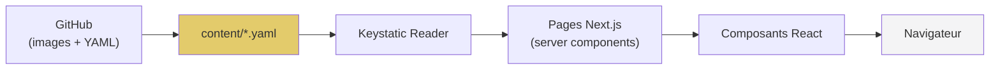
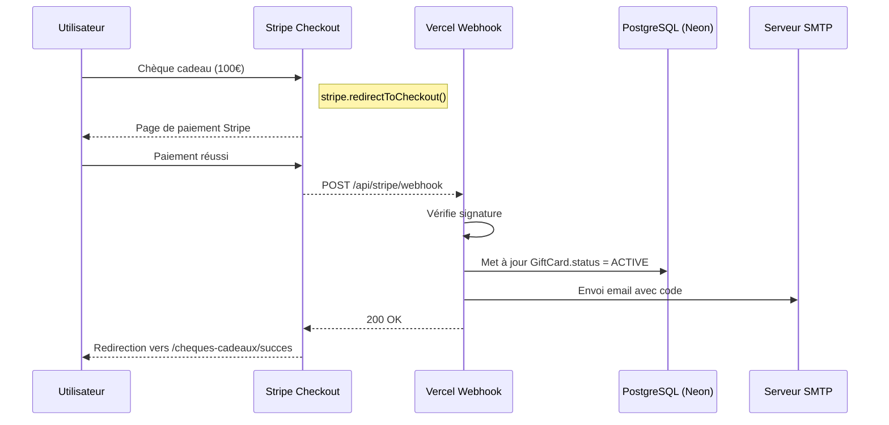

# Documentation Technique — ANØV

> **Public :** développeur
> **Objectif :** comprendre l'architecture, les dépendances et les mécanismes internes du projet

---

## 1. Architecture technique

### 1.1 Stack

| Couche          | Technologie          | Version           |
| --------------- | -------------------- | ----------------- |
| Framework       | Next.js              | 15.x (App Router) |
| Langage         | TypeScript           | 5.x               |
| UI              | React                | 18.3.1            |
| Styling         | Tailwind CSS         | 4.1.12            |
| Composants      | Radix UI + shadcn/ui | —                 |
| CMS             | Keystatic            | 0.5.x / 5.0.x     |
| Auth            | jose (JWT)           | 6.x               |
| ORM             | Prisma               | 7.8.x             |
| DB              | PostgreSQL           | 16                |
| Hébergement     | Vercel               | —                 |
| Package manager | pnpm                 | —                 |

### 1.2 Architecture du projet

```
anov/
├── content/                    # Fichiers YAML du CMS (source de vérité)
│   ├── hero.yaml
│   ├── footer.yaml
│   ├── contact.yaml
│   ├── galerie.yaml
│   ├── histoire.yaml
│   └── menu.yaml
├── keystatic.config.ts         # Configuration du CMS
├── prisma/
│   ├── schema.prisma           # Modèle de données
│   ├── seed.ts                 # Seed initial
│   └── migrations/
├── public/assets/              # Images statiques
├── scripts/
├── src/
│   ├── middleware.ts           # Protection routes /admin, /keystatic
│   ├── app/
│   │   ├── layout.tsx          # Layout racine (fetch CMS + ClientLayout)
│   │   ├── page.tsx            # Page d'accueil (Hero + Histoire + Galerie + Contact)
│   │   ├── ClientLayout.tsx    # Layout client (Navbar + Footer + SplashScreen)
│   │   ├── menu/page.tsx       # Page carte du restaurant
│   │   ├── admin/              # Dashboard admin
│   │   │   ├── page.tsx        # Redirect vers /admin/cms
│   │   │   ├── login/page.tsx  # Formulaire de connexion
│   │   │   ├── cms/            # Éditeur CMS intégré
│   │   ├── keystatic/          # Interface Keystatic
│   │   └── api/
│   │       ├── admin/auth/     # Authentification (POST login, DELETE logout)
│   │       └── keystatic/      # Routes Keystatic (route handler)
│   ├── components/
│   │   ├── Navbar.tsx          # Navigation (desktop + mobile)
│   │   ├── Footer.tsx          # Footer (données CMS)
│   │   ├── Hero.tsx            # Section hero (données CMS)
│   │   ├── History.tsx         # Section histoire (données CMS)
│   │   ├── Gallery.tsx         # Galerie photos (données CMS)
│   │   ├── Contact.tsx         # Section contact (données CMS)
│   │   ├── MenuContent.tsx     # Affichage carte (données CMS)
│   │   ├── SplashScreen.tsx    # Écran de chargement
│   │   ├── AdminNav.tsx        # Navigation admin
│   │   └── ui/                 # Composants shadcn/ui
│   └── lib/
│       ├── prisma.ts           # Singleton Prisma (adapter auto local/prod)
│       ├── auth.ts             # JWT sign/verify, cookie management
│       ├── email.ts            # Templates emails
│       └── availability.ts     # Logique de disponibilité des créneaux
├── styles/
│   ├── index.css               # Import des styles
│   ├── fonts.css               # Polices
│   ├── tailwind.css            # Config Tailwind
│   └── theme.css               # Variables CSS
├── prisma.config.ts
├── next.config.ts
├── tsconfig.json
├── docker-compose.yml
└── package.json
```

### 1.3 Flux de données



Le contenu éditorial est stocké dans des fichiers YAML dans `content/`. Next.js lit ces fichiers à chaque requête (dev) ou au build (prod) via le reader Keystatic. Les données sont passées aux composants React comme props.

---

## 2. Configuration Keystatic

### 2.1 Configuration du stockage

```typescript
// keystatic.config.ts
export default config({
  storage: {
    kind: 'github',
    repo: 'nderousseaux/anov',
  },
  singletons: { ... }
});
```

Le stockage est configuré en mode `github`. Les fichiers YAML sont lus/écrits directement dans le repository GitHub.

### 2.2 Singletons définis

| Singleton  | Path               | Type                             |
| ---------- | ------------------ | -------------------------------- |
| `hero`     | `content/hero`     | Image + texte                    |
| `histoire` | `content/histoire` | Multi-sections (texte + images)  |
| `galerie`  | `content/galerie`  | Array de photos                  |
| `contact`  | `content/contact`  | Texte + image + liens            |
| `footer`   | `content/footer`   | Réseaux sociaux + avis           |
| `menu`     | `content/menu`     | Multi-onglets, catégories, plats |

### 2.3 Configuration de production

En production Vercel, le mode `github` nécessite :

| Variable                         | Description                     |
| -------------------------------- | ------------------------------- |
| `KEYSTATIC_GITHUB_CLIENT_ID`     | Client ID de l'GitHub App       |
| `KEYSTATIC_GITHUB_CLIENT_SECRET` | Client secret                   |
| `KEYSTATIC_SECRET`               | Secret pour signer les sessions |
| `KEYSTATIC_GITHUB_REPOSITORY`    | Format `owner/repo`             |

> **Note :** En local, le mode `local` fonctionne parfaitement. En production, le mode `github` permet l'édition via GitHub App.

---

## 3. Authentification admin

L'authentification utilise des tokens JWT avec la bibliothèque `jose` :

- **Cookie :** `anov_admin_token` (httpOnly, 8h)
- **Middleware :** protège `/admin/*`, `/keystatic/*` et `/api/keystatic/*`
- **Stockage :** modèle `Admin` en base PostgreSQL (email + hash SHA-256)
- **API :** POST `/api/admin/auth` (login), DELETE `/api/admin/auth` (logout)

---

## 4. Services externes

| Service    | Usage                           | Accès                                                                |
| ---------- | ------------------------------- | -------------------------------------------------------------------- |
| **GitHub** | Stockage fichiers YAML + images | [github.com/nderousseaux/anov](https://github.com/nderousseaux/anov) |
| **Vercel** | Hébergement + déploiement       | [vercel.com](https://vercel.com)                                     |
| **Neon**   | Base de données PostgreSQL      | [neon.tech](https://neon.tech)                                       |

---

## 4.1. Système d'emails

Le système d'envoi d'emails utilise **nodemailer** avec un serveur SMTP personnalisé.

#### Fonctionnalités

- **Formulaire de contact :**
  - Envoi d'un email de notification à l'adresse configurée (`CONTACT_EMAIL`)
  - Envoi d'un email de confirmation à l'utilisateur
- **Réservations :**
  - Email de confirmation de réservation
  - Email de rappel (J-1)
  - Email d'annulation
- **Chèques cadeaux :**
  - Email de notification au destinataire avec le code unique
  - Instructions d'utilisation

### Configuration SMTP

Les variables d'environnement suivantes doivent être configurées :

| Variable        | Description                     | Exemple                                     |
| --------------- | ------------------------------- | ------------------------------------------- |
| `SMTP_HOST`     | Hôte du serveur SMTP            | `smtp.example.com`                          |
| `SMTP_PORT`     | Port du serveur SMTP            | `587` (STARTTLS) ou `465` (SSL)             |
| `SMTP_SECURE`   | Utiliser SSL (port 465)         | `false` pour port 587, `true` pour port 465 |
| `SMTP_USER`     | Nom d'utilisateur SMTP          | `noreply@anov.fr`                           |
| `SMTP_PASSWORD` | Mot de passe SMTP               | `votre_mot_de_passe`                        |
| `SMTP_FROM`     | Expéditeur par défaut           | `"ANØV <noreply@anov.fr>"`                  |
| `CONTACT_EMAIL` | Email de réception des contacts | `contact@anov.fr`                           |

### API Route

| Route          | Méthode | Description                                     |
| -------------- | ------- | ----------------------------------------------- |
| `/api/contact` | POST    | Envoi d'un message via le formulaire de contact |

**Payload :**

```json
{
  "name": "Jean Dupont",
  "email": "jean.dupont@example.com",
  "subject": "Demande d'information",
  "message": "Votre message..."
}
```

**Réponse :**

```json
{
  "message": "Message envoyé avec succès",
  "details": {
    "notificationSent": true,
    "confirmationSent": true
  }
}
```

---

## 5. Composants de la vitrine

| Composant      | Description                               |
| -------------- | ----------------------------------------- |
| `Navbar`       | Navigation responsive avec scroll fluide  |
| `Footer`       | Footer avec données CMS (réseaux, avis)   |
| `Hero`         | Section haute avec image et sous-titre    |
| `History`      | Section histoire (jusqu'à 8 sections)     |
| `Gallery`      | Galerie photos avec lightbox              |
| `Contact`      | Section contact avec formulaire           |
| `MenuContent`  | Affichage de la carte en onglets          |
| `OriginsMap`   | Carte interactive des origines avec D3.js |
| `SplashScreen` | Animation de chargement initial           |

### OriginsMap — Carte des origines

**Librairie :** `d3` (7.9.0) pour projection géographique et rendu SVG

**Données :** `/public/europe.geojson` (frontières Europe) + `content/origines.yaml` (points d'origine)

**Mécanisme :**

- Projection Mercator centrée sur Besançon (47.2378°N, 6.0244°E)
- Lignes radiales dorées reliant chaque ville à Besançon
- Masque SVG pour fondu vers les bords (desktop)
- Interactivité : hover (desktop) / clic (mobile) pour tooltips

**Points :** Chaque point a `label`, `latitude`, `longitude`, `title_*`, `description_*`, `image`, `url`

---

## 6. API Routes

### 6.1 Authentification

| Route             | Méthode | Description                     |
| ----------------- | ------- | ------------------------------- |
| `/api/admin/auth` | POST    | Connexion (username + password) |
| `/api/admin/auth` | DELETE  | Déconnexion                     |

### 6.2 Keystatic

| Route                        | Méthode  | Description             |
| ---------------------------- | -------- | ----------------------- |
| `/api/keystatic/[...params]` | GET/POST | Routes Keystatic (CRUD) |

### 6.3 Contact

| Route          | Méthode | Description                   |
| -------------- | ------- | ----------------------------- |
| `/api/contact` | POST    | Envoi d'un message de contact |

### 6.4 Chèques Cadeaux

| Route                      | Méthode | Description                                             |
| -------------------------- | ------- | ------------------------------------------------------- |
| `/api/gift-cards/checkout` | POST    | Création d'une session de paiement Stripe (client)      |
| `/api/admin/gift-cards`    | POST    | Création manuelle d'un chèque cadeau (admin)            |
| `/api/admin/gift-cards`    | PATCH   | Actions sur un chèque (utiliser, annuler, supprimer)    |
| `/api/stripe/webhook`      | POST    | Webhook Stripe (gestion réservations + chèques cadeaux) |

#### `/api/gift-cards/checkout`

**Payload :**

```json
{
  "amount": "100",
  "recipientEmail": "destinataire@example.com",
  "personalMessage": "Bonne dégustation !"
}
```

**Réponse :**

```json
{
  "sessionId": "cs_test_...",
  "url": "https://checkout.stripe.com/..."
}
```

**Logique :**

1. Génère un code unique (`ANOV-G-XXXX-XXXX`)
2. Crée l'enregistrement `GiftCard` en base avec statut `PENDING_PAYMENT`
3. Crée la session Stripe Checkout
4. Retourne l'URL de paiement

#### `/api/admin/gift-cards` (POST)

**Payload :**

```json
{
  "amount": 100,
  "recipientEmail": "destinataire@example.com",
  "personalMessage": "Bonne dégustation !"
}
```

**Réponse :**

```json
{
  "id": "clxxxxx",
  "code": "ANOV-M-XXXX-XXXX",
  "amount": 100,
  "recipientEmail": "destinataire@example.com",
  "personalMessage": "Bonne dégustation !",
  "isPaid": false,
  "status": "ACTIVE",
  "createdAt": "...",
  "expiresAt": "..."
}
```

**Logique :**

1. Génère un code unique avec préfixe `ANOV-M-` (Manuel)
2. Crée l'enregistrement `GiftCard` en base avec statut `ACTIVE`
3. Envoie un email au destinataire si email fourni
4. Retourne les détails du chèque créé

#### `/api/admin/gift-cards` (PATCH)

| Action     | Payload                      | Description                       |
| ---------- | ---------------------------- | --------------------------------- |
| `markUsed` | `{ id, action: "markUsed" }` | Marque le chèque comme utilisé    |
| `validate` | `{ id, action: "validate" }` | Remet le chèque comme non utilisé |
| `delete`   | `{ id, action: "delete" }`   | Supprime le chèque                |

#### `/api/stripe/webhook`

Gère deux types de paiements :

- **Réservations** (metadata: `name`, `email`, `date`, `guests`)
- **Chèques cadeaux** (metadata: `type: 'gift_card'`, `giftCardId`)

**Webhook Events :**

- `checkout.session.completed` : Confirme le paiement et active le chèque

**Activation du chèque cadeau (client) :**

1. Récupère le chèque via `giftCardId`
2. Met à jour le statut à `ACTIVE`
3. Envoie l'email avec le code au destinataire
4. Loggue l'activité

### 6.5 Stripe

| Variable                             | Description                      |
| ------------------------------------ | -------------------------------- |
| `STRIPE_SECRET_KEY`                  | Clé API secrète                  |
| `NEXT_PUBLIC_STRIPE_PUBLISHABLE_KEY` | Clé API publique                 |
| `STRIPE_WEBHOOK_SECRET`              | Secret de signature des webhooks |

---

## 7. Configuration Vercel

| Variable                         | Usage                              |
| -------------------------------- | ---------------------------------- |
| `NEXTAUTH_SECRET`                | Clé JWT (min. 32 caractères)       |
| `KEYSTATIC_GITHUB_CLIENT_ID`     | GitHub App pour le CMS             |
| `KEYSTATIC_GITHUB_CLIENT_SECRET` | GitHub App                         |
| `KEYSTATIC_SECRET`               | Session Keystatic                  |
| `KEYSTATIC_GITHUB_REPOSITORY`    | Repository GitHub                  |
| `NEXT_PUBLIC_BASE_URL`           | URL du site                        |
| `DATABASE_URL`                   | URL de connexion PostgreSQL (Neon) |
| `SMTP_HOST`                      | Hôte du serveur SMTP               |
| `SMTP_PORT`                      | Port du serveur SMTP               |
| `SMTP_SECURE`                    | SSL activé (true/false)            |
| `SMTP_USER`                      | Utilisateur SMTP                   |
| `SMTP_PASSWORD`                  | Mot de passe SMTP                  |
| `SMTP_FROM`                      | Expéditeur par défaut              |
| `CONTACT_EMAIL`                  | Email de réception des contacts    |

---

## 8. Déploiement

- **Environnement de preview :** push sur `pprod`
- **Production :** merge `pprod` → `main`
- Les images du CMS sont stockées dans `public/assets/` et commitées via Git

---

## 9. Intégration Stripe en production (Vercel)

### 9.1 Configuration locale (développement)

En local, pour tester les webhooks Stripe, utilise `stripe-cli` :

```bash
# Installer stripe-cli (macOS)
brew install stripe/tap/stripe

# Forwarder les webhooks vers ton localhost
stripe listen --forward-to localhost:3000/api/stripe/webhook
```

Stripe te fournira un **secret de signature** (ex: `whsec_xxxxxxxxxxxx`) que tu ajoutes à ton `.env.local` :

```env
STRIPE_WEBHOOK_SECRET=whsec_xxxxxxxxxxxx
```

### 9.2 Configuration production (Vercel)

En production, **tu n'as pas besoin de `stripe listen`** car Vercel expose déjà tes API routes publicatement.

#### Étapes de déploiement :

1. **Déployer ton app sur Vercel**

   ```bash
   git push origin main  # ou pprod pour preview
   ```

2. **Créer un webhook dans le Dashboard Stripe**
   - Aller sur https://dashboard.stripe.com/webhooks
   - Clic sur **"Add endpoint"**
   - URL : `https://ton-app.vercel.app/api/stripe/webhook`
   - Sélectionner les événements :
     - `checkout.session.completed` (obligatoire)

3. **Copier le Signing Secret**
   - Stripe affiche un secret (ex: `whsec_1234567890abcdef`)
   - Copier cette valeur et la mettre dans STRIPE_WEBHOOK_SECRET sur Vercel

4. **Ajouter les variables d'environnement sur Vercel**

   Dans les **Settings → Environment Variables** de ton projet Vercel :

   | Variable                             | Valeur                 | Type       |
   | ------------------------------------ | ---------------------- | ---------- |
   | `STRIPE_SECRET_KEY`                  | `sk_live_xxxxxxxxxxxx` | Production |
   | `STRIPE_WEBHOOK_SECRET`              | `whsec_xxxxxxxxxxxx`   | Production |
   | `NEXT_PUBLIC_STRIPE_PUBLISHABLE_KEY` | `pk_live_xxxxxxxxxxxx` | Production |

   > **Important :** Cocher "Production" pour que les variables soient accessibles en prod.

5. **Redéployer**
   - Après avoir ajouté les variables, Vercel te propose de redeployer
   - Ou fait un `git push` pour déclencher un nouveau déploiement

### 9.3 Vérification du webhook

Après déploiement, tu peux tester manuellement :

```bash
# Tester l'endpoint (aura une erreur de signature, mais vérifie que l'URL répond)
curl -X POST https://ton-app.vercel.app/api/stripe/webhook \
  -H "Stripe-Signature: test"
```

Pour un test complet, utilise l'interface Stripe :

- Dashboard → **Webhooks** → Sélectionne ton endpoint
- Clic sur **"Send test webhook"**
- Choisir l'événement `checkout.session.completed`
- Vérifier les logs dans les **Deployments** de Vercel

### 9.4 Flux de paiement complet



### 9.5 Codes de statut du webhook

Le webhook retourne :

- `200 OK` : Traitement successful
- `400 Bad Request` : Signature invalide ou metadata manquantes
- `500 Internal Error` : Erreur serveur (base de données, email, etc.)

---

## 9. Notes techniques

## 9. Notes techniques

- **Server Components :** Pages qui fetch le contenu CMS au runtime
- **Client Components :** Composants interactifs (Navbar, Hero, etc.) avec `'use client'`
- **Keystatic Reader :** `createReader(process.cwd(), config)` pour lire les YAML
- **Prisma adapter :** Détection auto local/prod (PostgreSQL direct ou Neon serverless)
- **TypeScript strict :** `strict: true`, `noEmit: true`
