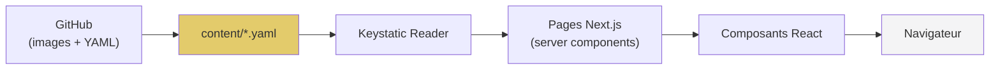

# Documentation Technique — ANØV

> **Public :** développeur
> **Objectif :** comprendre l'architecture, les dépendances et les mécanismes internes du projet

---

## 1. Architecture technique

### 1.1 Stack

| Couche | Technologie | Version |
|---|---|---|
| Framework | Next.js | 15.x (App Router) |
| Langage | TypeScript | 5.x |
| UI | React | 18.3.1 |
| Styling | Tailwind CSS | 4.1.12 |
| Composants | Radix UI + shadcn/ui | — |
| CMS | Keystatic | 0.5.x / 5.0.x |
| Auth | jose (JWT) | 6.x |
| ORM | Prisma | 7.8.x |
| DB | PostgreSQL | 16 |
| Hébergement | Vercel | — |
| Package manager | pnpm | — |

### 1.2 Architecture du projet

```
anov/
├── content/                    # Fichiers YAML du CMS (source de vérité)
│   ├── hero.yaml
│   ├── footer.yaml
│   ├── contact.yaml
│   ├── galerie.yaml
│   ├── histoire.yaml
│   └── menu.yaml
├── keystatic.config.ts         # Configuration du CMS
├── prisma/
│   ├── schema.prisma           # Modèle de données
│   ├── seed.ts                 # Seed initial
│   └── migrations/
├── public/assets/              # Images statiques
├── scripts/
├── src/
│   ├── middleware.ts           # Protection routes /admin, /keystatic
│   ├── app/
│   │   ├── layout.tsx          # Layout racine (fetch CMS + ClientLayout)
│   │   ├── page.tsx            # Page d'accueil (Hero + Histoire + Galerie + Contact)
│   │   ├── ClientLayout.tsx    # Layout client (Navbar + Footer + SplashScreen)
│   │   ├── menu/page.tsx       # Page carte du restaurant
│   │   ├── admin/              # Dashboard admin
│   │   │   ├── page.tsx        # Redirect vers /admin/cms
│   │   │   ├── login/page.tsx  # Formulaire de connexion
│   │   │   ├── cms/            # Éditeur CMS intégré
│   │   ├── keystatic/          # Interface Keystatic
│   │   └── api/
│   │       ├── admin/auth/     # Authentification (POST login, DELETE logout)
│   │       └── keystatic/      # Routes Keystatic (route handler)
│   ├── components/
│   │   ├── Navbar.tsx          # Navigation (desktop + mobile)
│   │   ├── Footer.tsx          # Footer (données CMS)
│   │   ├── Hero.tsx            # Section hero (données CMS)
│   │   ├── History.tsx         # Section histoire (données CMS)
│   │   ├── Gallery.tsx         # Galerie photos (données CMS)
│   │   ├── Contact.tsx         # Section contact (données CMS)
│   │   ├── MenuContent.tsx     # Affichage carte (données CMS)
│   │   ├── SplashScreen.tsx    # Écran de chargement
│   │   ├── AdminNav.tsx        # Navigation admin
│   │   └── ui/                 # Composants shadcn/ui
│   └── lib/
│       ├── prisma.ts           # Singleton Prisma (adapter auto local/prod)
│       ├── auth.ts             # JWT sign/verify, cookie management
│       ├── email.ts            # Templates emails
│       └── availability.ts     # Logique de disponibilité des créneaux
├── styles/
│   ├── index.css               # Import des styles
│   ├── fonts.css               # Polices
│   ├── tailwind.css            # Config Tailwind
│   └── theme.css               # Variables CSS
├── prisma.config.ts
├── next.config.ts
├── tsconfig.json
├── docker-compose.yml
└── package.json
```

### 1.3 Flux de données



Le contenu éditorial est stocké dans des fichiers YAML dans `content/`. Next.js lit ces fichiers à chaque requête (dev) ou au build (prod) via le reader Keystatic. Les données sont passées aux composants React comme props.

---

## 2. Configuration Keystatic

### 2.1 Configuration du stockage

```typescript
// keystatic.config.ts
export default config({
  storage: {
    kind: 'github',
    repo: 'nderousseaux/anov',
  },
  singletons: { ... }
});
```

Le stockage est configuré en mode `github`. Les fichiers YAML sont lus/écrits directement dans le repository GitHub.

### 2.2 Singletons définis

| Singleton | Path | Type |
|---|---|---|
| `hero` | `content/hero` | Image + texte |
| `histoire` | `content/histoire` | Multi-sections (texte + images) |
| `galerie` | `content/galerie` | Array de photos |
| `contact` | `content/contact` | Texte + image + liens |
| `footer` | `content/footer` | Réseaux sociaux + avis |
| `menu` | `content/menu` | Multi-onglets, catégories, plats |

### 2.3 Configuration de production

En production Vercel, le mode `github` nécessite :

| Variable | Description |
|---|---|
| `KEYSTATIC_GITHUB_CLIENT_ID` | Client ID de l'GitHub App |
| `KEYSTATIC_GITHUB_CLIENT_SECRET` | Client secret |
| `KEYSTATIC_SECRET` | Secret pour signer les sessions |
| `KEYSTATIC_GITHUB_REPOSITORY` | Format `owner/repo` |

> **Note :** En local, le mode `local` fonctionne parfaitement. En production, le mode `github` permet l'édition via GitHub App.

---

## 3. Authentification admin

L'authentification utilise des tokens JWT avec la bibliothèque `jose` :

- **Cookie :** `anov_admin_token` (httpOnly, 8h)
- **Middleware :** protège `/admin/*`, `/keystatic/*` et `/api/keystatic/*`
- **Stockage :** modèle `Admin` en base PostgreSQL (email + hash SHA-256)
- **API :** POST `/api/admin/auth` (login), DELETE `/api/admin/auth` (logout)

---

## 4. Services externes

| Service | Usage | Accès |
|---|---|---|
| **GitHub** | Stockage fichiers YAML + images | [github.com/nderousseaux/anov](https://github.com/nderousseaux/anov) |
| **Vercel** | Hébergement + déploiement | [vercel.com](https://vercel.com) |
| **Neon** | Base de données PostgreSQL | [neon.tech](https://neon.tech) |

---

## 4.1. Système d'emails

Le système d'envoi d'emails utilise **nodemailer** avec un serveur SMTP personnalisé.

### Fonctionnalités

- **Formulaire de contact :**
  - Envoi d'un email de notification à l'adresse configurée (`CONTACT_EMAIL`)
  - Envoi d'un email de confirmation à l'utilisateur
- **Réservations :**
  - Email de confirmation de réservation
  - Email de rappel (J-1)
  - Email d'annulation

### Configuration SMTP

Les variables d'environnement suivantes doivent être configurées :

| Variable | Description | Exemple |
|---|---|---|
| `SMTP_HOST` | Hôte du serveur SMTP | `smtp.example.com` |
| `SMTP_PORT` | Port du serveur SMTP | `587` (STARTTLS) ou `465` (SSL) |
| `SMTP_SECURE` | Utiliser SSL (port 465) | `false` pour port 587, `true` pour port 465 |
| `SMTP_USER` | Nom d'utilisateur SMTP | `noreply@anov.fr` |
| `SMTP_PASSWORD` | Mot de passe SMTP | `votre_mot_de_passe` |
| `SMTP_FROM` | Expéditeur par défaut | `"ANØV <noreply@anov.fr>"` |
| `CONTACT_EMAIL` | Email de réception des contacts | `contact@anov.fr` |

### API Route

| Route | Méthode | Description |
|---|---|---|
| `/api/contact` | POST | Envoi d'un message via le formulaire de contact |

**Payload :**
```json
{
  "name": "Jean Dupont",
  "email": "jean.dupont@example.com",
  "subject": "Demande d'information",
  "message": "Votre message..."
}
```

**Réponse :**
```json
{
  "message": "Message envoyé avec succès",
  "details": {
    "notificationSent": true,
    "confirmationSent": true
  }
}
```

---

## 5. Composants de la vitrine

| Composant | Description |
|---|---|
| `Navbar` | Navigation responsive avec scroll fluide |
| `Footer` | Footer avec données CMS (réseaux, avis) |
| `Hero` | Section haute avec image et sous-titre |
| `History` | Section histoire (jusqu'à 8 sections) |
| `Gallery` | Galerie photos avec lightbox |
| `Contact` | Section contact avec formulaire |
| `MenuContent` | Affichage de la carte en onglets |
| `SplashScreen` | Animation de chargement initial |

---

## 6. API Routes

### 6.1 Authentification

| Route | Méthode | Description |
|---|---|---|
| `/api/admin/auth` | POST | Connexion (username + password) |
| `/api/admin/auth` | DELETE | Déconnexion |

### 6.2 Keystatic

| Route | Méthode | Description |
|---|---|---|
| `/api/keystatic/[...params]` | GET/POST | Routes Keystatic (CRUD) |

### 6.3 Contact

| Route | Méthode | Description |
|---|---|---|
| `/api/contact` | POST | Envoi d'un message de contact |

---

## 7. Configuration Vercel

| Variable | Usage |
|---|---|
| `NEXTAUTH_SECRET` | Clé JWT (min. 32 caractères) |
| `KEYSTATIC_GITHUB_CLIENT_ID` | GitHub App pour le CMS |
| `KEYSTATIC_GITHUB_CLIENT_SECRET` | GitHub App |
| `KEYSTATIC_SECRET` | Session Keystatic |
| `KEYSTATIC_GITHUB_REPOSITORY` | Repository GitHub |
| `NEXT_PUBLIC_BASE_URL` | URL du site |
| `DATABASE_URL` | URL de connexion PostgreSQL (Neon) |
| `SMTP_HOST` | Hôte du serveur SMTP |
| `SMTP_PORT` | Port du serveur SMTP |
| `SMTP_SECURE` | SSL activé (true/false) |
| `SMTP_USER` | Utilisateur SMTP |
| `SMTP_PASSWORD` | Mot de passe SMTP |
| `SMTP_FROM` | Expéditeur par défaut |
| `CONTACT_EMAIL` | Email de réception des contacts |

---

## 8. Déploiement

- **Environnement de preview :** push sur `pprod`
- **Production :** merge `pprod` → `main`
- Les images du CMS sont stockées dans `public/assets/` et commitées via Git

---

## 9. Notes techniques

- **Server Components :** Pages qui fetch le contenu CMS au runtime
- **Client Components :** Composants interactifs (Navbar, Hero, etc.) avec `'use client'`
- **Keystatic Reader :** `createReader(process.cwd(), config)` pour lire les YAML
- **Prisma adapter :** Détection auto local/prod (PostgreSQL direct ou Neon serverless)
- **TypeScript strict :** `strict: true`, `noEmit: true`
